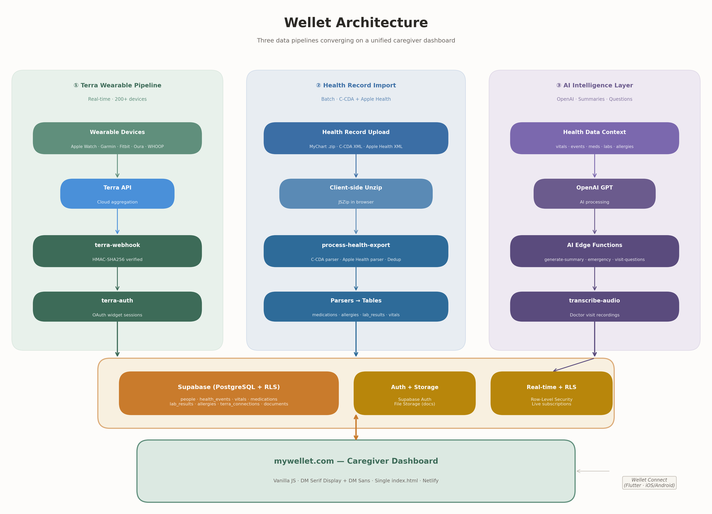

# Wellet

**A witness system for family caregivers.** Capture, organize, and surface the health history of the people you love.

53 million Americans are family caregivers, collectively providing $1.01 trillion in unpaid labor each year — and almost none of them have real-time visibility into the health of the person they're caring for. Wellet consolidates fragmented health data — EHR records, wearable biometrics, documents, and manual entries — into a single AI-interpreted view so caregivers can understand what's actually happening.

**Live app:** [mywellet.com](https://mywellet.com) · **Marketing site:** [getwellet.com](https://getwellet.com) · **Guided demo:** [mywellet.com/?demo=guided](https://mywellet.com/?demo=guided)

---

## Architecture



Three data pipelines converge on a unified caregiver dashboard, all backed by Supabase with row-level security:

## Data Pipeline

Wellet ingests health data from three pathways, all converging on the same `vitals` and `health_events` tables:

### 1. Terra Wearable Pipeline (real-time)

Live streaming from 200+ wearable devices — Apple Watch, Garmin, Fitbit, Oura, WHOOP, Samsung, and more.

```
Wearable Device → Terra API → terra-webhook (HMAC verified) → vitals + health_events
```

- **`terra-auth`** — Generates Terra widget sessions for OAuth device connection. Stores, lists, and disconnects wearable connections in `terra_connections`.
- **`terra-webhook`** — Receives HMAC-SHA256 signed payloads from Terra. Maps `daily`, `body`, `sleep`, and `activity` data types to Wellet's schema. Handles `auth`/`deauth` lifecycle events. All entries tagged with `source='terra'` and `ehr_system='terra_{provider}'`.

Data mapping:

| Terra Payload | Wellet Table | Fields |
|---|---|---|
| `daily` | `vitals` | Resting HR, HRV, SpO2 |
| `daily` | `health_events` | Steps summary, calories |
| `body` | `vitals` | Weight, body fat, height |
| `sleep` | `health_events` | Sleep duration, stages, score |
| `activity` | `health_events` | Steps, distance, calories, exercise time |

### 2. Health Record Import (batch)

Upload once, extract everything. Supports two clinical document formats:

```
User uploads .zip/.xml → process-health-export → C-CDA parser or Apple Health parser → deduplicator → tables
```

- **C-CDA XML Parser** — Extracts medications, allergies, lab results, vitals, and conditions from standard clinical documents (CDA R2, by LOINC section codes). Handles MyChart exports, hospital discharge summaries, and any CDA-compliant EHR export.
- **Apple Health XML Parser** — Extracts wearable/device data from Apple Health `export.xml`. Parses Record elements (HR, BP, SpO2, steps, sleep), Workout elements, and ActivitySummary (daily rings). Sampling strategy for large exports: last 90 days, one HR reading per hour, daily step/distance/calorie aggregates.
- **Deduplicator** — Prevents duplicate records across repeated imports using composite key matching (person + test/type + date + value).
- **Client-side unzip** — Large exports are unzipped in the browser via JSZip. Individual XML files are uploaded to Supabase Storage, and their paths are sent to the edge function for processing.

### 3. Manual Entry + AI

Caregivers can manually log health events, medications, and vitals directly in the dashboard. The AI layer processes this alongside imported data:

- **`generate-summary`** — AI-powered "Update Me" summaries that synthesize a loved one's recent health picture
- **`generate-emergency-summary`** — One-page emergency health summary (medications, allergies, conditions, contacts) for ER visits
- **`generate-visit-questions`** — AI-generated questions for upcoming doctor visits based on health history
- **`transcribe-audio`** — Record and transcribe doctor visit conversations

## Supabase Schema

All tables enforce row-level security — users only see data for people in their care circle.

### Core Tables

| Table | Purpose |
|---|---|
| `people` | Care recipients linked to a caregiver's auth account |
| `health_events` | Timestamped health events (conditions, procedures, appointments, activity) |
| `medications` | Active and historical medications with dose, frequency, prescriber |
| `vitals` | Vital signs (HR, BP, SpO2, weight, temperature, etc.) |
| `lab_results` | Lab values with reference ranges, LOINC codes, normal/abnormal status |
| `allergies` | Allergies with substance, reaction, severity |
| `documents` | Uploaded files (health exports, discharge summaries, photos) |

### Wearable Integration

| Table | Purpose |
|---|---|
| `terra_connections` | Active wearable device connections per person — provider, scopes, status, last data timestamp |

### Care Circle + Sharing

| Table | Purpose |
|---|---|
| `care_circle` | Family members and caregivers linked to a person with role-based access |
| `shares` | Tokenized read-only health summaries shareable via link |
| `update_me_summaries` | Cached AI-generated health summaries (one per person) |

### Engagement + Growth

| Table | Purpose |
|---|---|
| `waitlist` | Email signups from getwellet.com |
| `waitlist_requests` | Alpha access requests with priority scoring |
| `alpha_allowlist` | Approved alpha users |
| `community_fund_pool` | End-of-care journey — donated subscription days |

## Edge Functions

| Function | Auth | Purpose |
|---|---|---|
| `terra-webhook` | HMAC-SHA256 | Receives + maps wearable data from Terra API |
| `terra-auth` | JWT (Supabase) | Manages wearable device connections via Terra widget |
| `process-health-export` | JWT | Parses C-CDA XML, Apple Health XML, deduplicates, writes to tables |
| `generate-summary` | JWT | AI health summary generation (OpenAI) |
| `generate-emergency-summary` | JWT | One-page ER-ready health summary |
| `generate-visit-questions` | JWT | AI-generated doctor visit questions |
| `transcribe-audio` | JWT | Audio transcription for visit recordings |
| `extract-onboarding` | JWT | Extracts structured data from uploaded onboarding documents |
| `care-circle-invite` | JWT | Sends care circle invitations |
| `create-share` | JWT | Generates tokenized share links |
| `manage-allowlist` | JWT | Alpha access allowlist management |
| `fetch-ehr-data` | JWT | 1upHealth EHR connection (future) |
| `oneup-auth` | JWT | 1upHealth OAuth flow (future) |

## Tech Stack

- **Client:** Vanilla JS, single `index.html` (11K lines), no build step
- **Fonts:** DM Serif Display (headings) + DM Sans (body)
- **Icons:** Lucide (self-hosted, initialized via `initIcons()` after dynamic HTML)
- **Backend:** Supabase (PostgreSQL, Auth, Storage, Edge Functions, RLS)
- **Edge Functions:** Deno (TypeScript), deployed to Supabase
- **Wearables:** Terra API (200+ devices, real-time webhooks)
- **AI:** OpenAI (summaries, emergency plans, visit questions, transcription)
- **Hosting:** Netlify (auto-deploy from `main`)
- **Security:** All user-generated content escaped via `escHtml()`, RLS on every table, HMAC webhook verification, session-scoped auth

## Security

- **Row-Level Security** on every table — queries are scoped to `auth.uid()` or care circle membership
- **HMAC-SHA256** verification on all Terra webhook payloads (constant-time comparison, 5-minute timestamp tolerance)
- **JWT validation** on all user-facing edge functions via Supabase `getUser()`
- **XSS prevention** — all user-generated content rendered through `escHtml()`
- **Encrypted and isolated** — health data protected with Supabase's encryption at rest + RLS isolation

## Development

```bash
# Clone
git clone https://github.com/wellet-app/wellet.git
cd wellet

# The client is a single index.html — open it directly or serve locally
npx serve .

# Edge functions (requires Supabase CLI)
supabase functions serve terra-webhook --no-verify-jwt
supabase functions serve terra-auth --no-verify-jwt
supabase functions serve process-health-export
```

### Environment Secrets (Supabase Edge Functions)

| Secret | Source |
|---|---|
| `TERRA_API_KEY` | Terra dashboard (production) |
| `TERRA_DEV_ID` | Terra dashboard (production) |
| `TERRA_WEBHOOK_SECRET` | Terra dashboard (webhook signing secret) |
| `OPENAI_API_KEY` | OpenAI platform |

### Tests

```bash
npm test                    # Security + integration tests (Playwright)
```

## Related Repositories

| Repo | Purpose |
|---|---|
| [wellet-app/wellet](https://github.com/wellet-app/wellet) | This repo — mywellet.com caregiver dashboard |
| [wellet-app/getwellet](https://github.com/wellet-app/getwellet) | Marketing site + waitlist (getwellet.com) |
| [wellet-app/wellet-connect](https://github.com/wellet-app/wellet-connect) | Flutter companion app for care recipients (iOS + Android) |

## License

Private. All rights reserved.

---

Built by [Betsy Eble](https://x.com/betsyeble) — 20 years of healthcare UX, now building the tool she needed as a caregiver.
